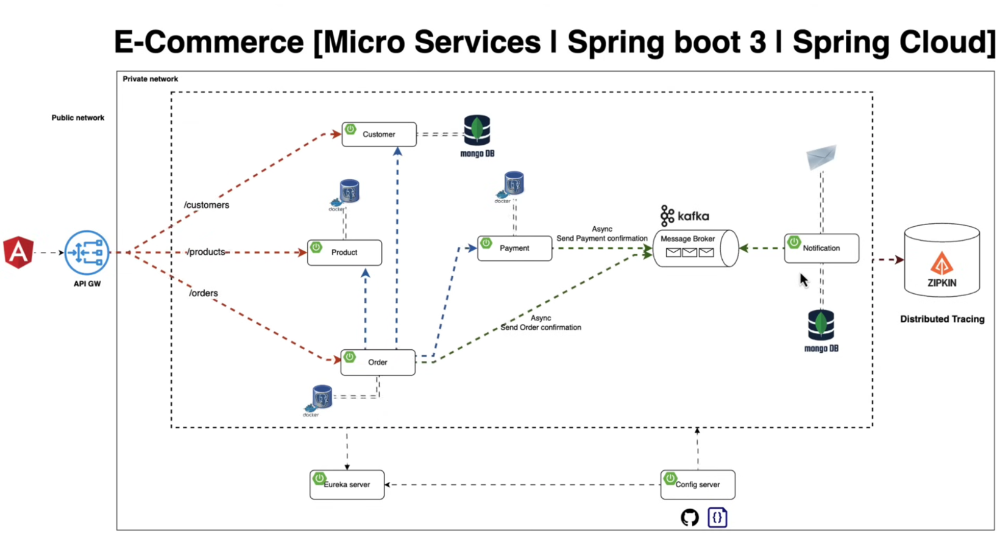

# E-Commerce Microservices Application

This project is an advanced e-commerce application built using microservices architecture, leveraging Spring Boot 3 and Spring Cloud technologies.



## Architecture Overview

Our e-commerce platform is designed with a microservices architecture to ensure scalability, maintainability, and resilience. The system is divided into public and private networks for enhanced security.

### Key Components

- **Angular Frontend**: Serves as the user interface for customers.
- **API Gateway**: Acts as the single entry point for all client requests.
- **Microservices**:
  - Customer Service (MongoDB)
  - Product Service (Relational DB)
  - Order Service (Relational DB)
  - Payment Service (Relational DB)
  - Notification Service (MongoDB)
- **Kafka**: Message broker for asynchronous communication.
- **Eureka Server**: Service discovery for microservices.
- **Config Server**: Centralized configuration management.
- **Zipkin**: Distributed tracing system.

## Features

- Secure API Gateway routing
- Asynchronous inter-service communication via Kafka
- Service discovery and registration with Eureka
- Centralized configuration management
- Distributed tracing for monitoring and troubleshooting
- Scalable microservices architecture

## Technologies Used

- Spring Boot 3
- Spring Cloud
- Angular
- MongoDB
- Relational Databases (e.g., PostgreSQL, MySQL)
- Apache Kafka
- Netflix Eureka
- Zipkin
- Docker (for containerization)

## Getting Started

### Prerequisites

- JDK 17 or later
- Maven 3.6+
- Node.js and npm (for Angular frontend)
- Docker and Docker Compose

### Running the Application

1. Clone the repository:
   ```git clone https://github.com/your-username/ecommerce-microservices.git```

2. Navigate to the project directory:```cd ecommerce-microservices```

3. Start the infrastructure services (Kafka, Zipkin, etc.) using Docker Compose:```docker-compose up -d```

4. Start the Config Server and Eureka Server.

5. Launch the microservices (Customer, Product, Order, Payment, Notification).

6. Start the API Gateway.

7. Run the Angular frontend: 
```
cd frontend 
npm install
ng serve
   ```

8. Access the application at `http://localhost:4200`.

## API Documentation

API documentation is available via Swagger UI for each microservice. Access it at:

`http://localhost:<service-port>/swagger-ui.html`

## Contributing

We welcome contributions to this project. Please read our [CONTRIBUTING.md](CONTRIBUTING.md) file for details on our code of conduct and the process for submitting pull requests.

## License

This project is licensed under the MIT License - see the [LICENSE.md](LICENSE.md) file for details.

## Acknowledgments

- Spring Boot and Spring Cloud communities
- Netflix OSS team for Eureka
- Apache Kafka team
- OpenZipkin team
